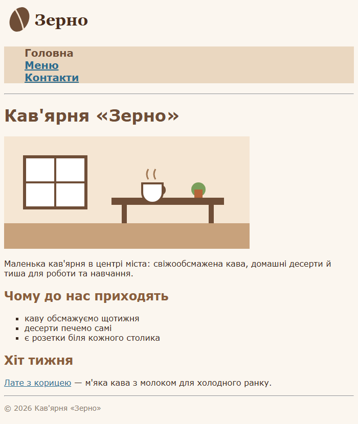
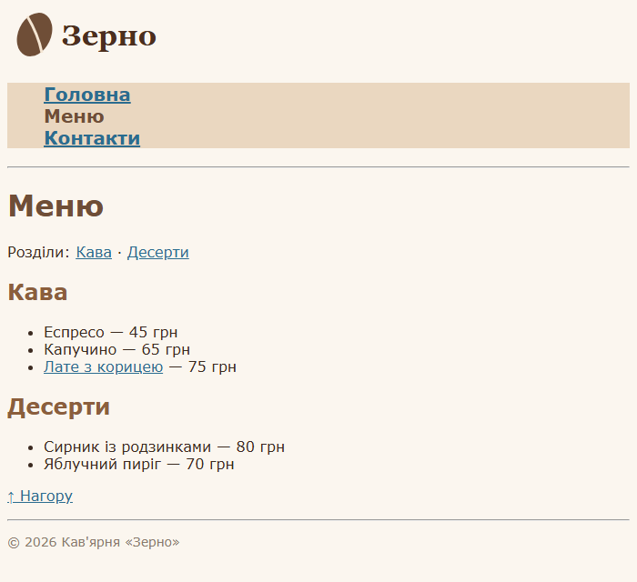
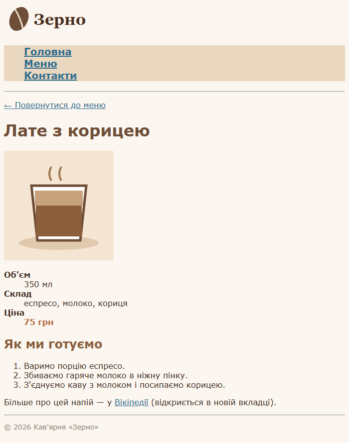
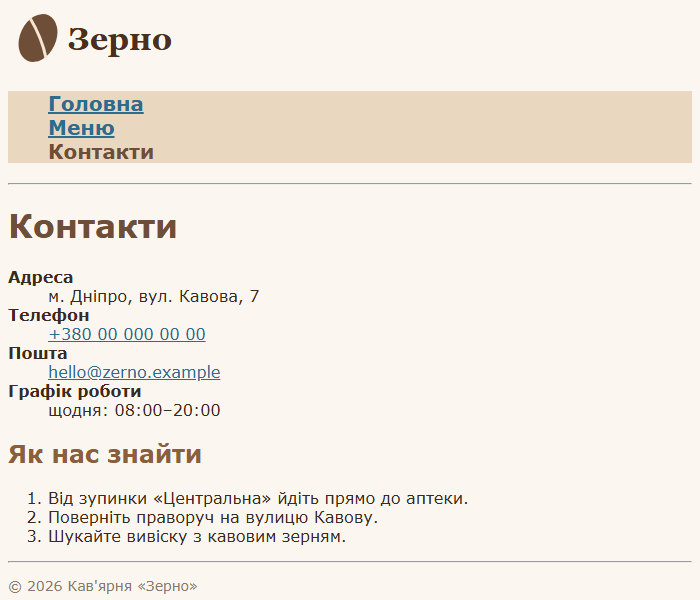

`Домашня робота №2`

## Створення багатосторінкового сайту

Створити невеликий сайт з **4 сторінок** на **власну тему**: улюблене хобі, вигаданий заклад, магазин,
клуб тощо. Сторінки мають бути пов'язані між собою посиланнями та мати однакове меню й оформлення.

**Приклади тем:**

| Тема | Перелік | Детальна сторінка |
| :---- | :---- | :---- |
| **Кав'ярня або піцерія** | меню | одна страва чи напій |
| **Туристичні маршрути Україною** | список маршрутів | маршрут із програмою по днях |
| **Притулок для тварин** | «Наші хвостики» | картка однієї тварини |
| **Магазин настільних ігор** | каталог ігор | сторінка однієї гри |
| **Спортивна секція чи гурток** | напрями занять | один напрям і «Як записатися» |
| **Фан-сайт гри, серіалу чи гурту** | персонажі або учасники | один персонаж чи учасник |

**Сторінки сайту:**

| Сторінка | Файл | Що має бути |
| :---- | :---- | :---- |
| **Головна** | `index.html` | назва й короткий опис сайту, зображення, маркований список (`ul`) |
| **Перелік** | на ваш вибір (`menu.html`, `catalog.html` …) | щонайменше два розділи з переходом до них через якорі, посилання «↑ Нагору» |
| **Детальна сторінка** | на ваш вибір (`latte.html`, `game.html` …) | один об'єкт з переліку: зображення, характеристики списком визначень (`dl`), нумерований список (`ol`), посилання на зовнішній сайт у новій вкладці (з попередженням) |
| **Контакти** | `contacts.html` | вигадані адреса, телефон (`tel:`) і пошта (`mailto:`) |

**Вимоги до всього сайту:**

- на кожній сторінці — логотип або назва, що веде на головну, і **однакове меню** (список без маркерів);
  пункт поточної сторінки виділено й він не є посиланням
- з переліку можна перейти на детальну сторінку, а з неї — повернутися назад
- один спільний файл `style.css` для всіх сторінок; оформлення посилань для станів `:visited` і `:hover`
- зображення — у папці `images/`, у кожного є атрибут `alt` (зображення можна брати з інтернету)
- імена файлів і папок — латиницею, малими літерами, без пробілів

---

### Приклад виконання

Сайт вигаданої кав'ярні «Зерно».

```
zerno/
├── index.html
├── menu.html
├── latte.html
├── contacts.html
├── style.css
└── images/
    ├── logo.svg
    ├── cafe.svg
    └── latte.svg
```









<details>
<summary><b>📄 index.html</b></summary>

```html
<!DOCTYPE html>
<html lang="uk">
<head>
    <meta charset="UTF-8">
    <meta name="viewport" content="width=device-width, initial-scale=1.0">
    <title>Зерно — кав'ярня</title>
    <link rel="stylesheet" href="style.css">
</head>
<body>
    <a href="index.html"></a>
    <ul class="menu">
        <li class="current">Головна</li>
        <li><a href="menu.html">Меню</a></li>
        <li><a href="contacts.html">Контакти</a></li>
    </ul>
    <hr>

    <h1>Кав'ярня «Зерно»</h1>
    <p></p>
    <p>Маленька кав'ярня в центрі міста: свіжообсмажена кава, домашні десерти й тиша для роботи та навчання.</p>

    <h2>Чому до нас приходять</h2>
    <ul class="benefits">
        <li>каву обсмажуємо щотижня</li>
        <li>десерти печемо самі</li>
        <li>є розетки біля кожного столика</li>
    </ul>

    <h2>Хіт тижня</h2>
    <p><a href="latte.html">Лате з корицею</a> — м'яка кава з молоком для холодного ранку.</p>

    <hr>
    <p class="footer">&copy; 2026 Кав'ярня «Зерно»</p>
</body>
</html>
```

</details>

<details>
<summary><b>📄 menu.html</b></summary>

```html
<!DOCTYPE html>
<html lang="uk">
<head>
    <meta charset="UTF-8">
    <meta name="viewport" content="width=device-width, initial-scale=1.0">
    <title>Меню — Зерно</title>
    <link rel="stylesheet" href="style.css">
</head>
<body>
    <a href="index.html"></a>
    <ul class="menu">
        <li><a href="index.html">Головна</a></li>
        <li class="current">Меню</li>
        <li><a href="contacts.html">Контакти</a></li>
    </ul>
    <hr>

    <h1 id="top">Меню</h1>
    <p>Розділи: <a href="#coffee">Кава</a> · <a href="#desserts">Десерти</a></p>

    <h2 id="coffee">Кава</h2>
    <ul>
        <li>Еспресо — 45&nbsp;грн</li>
        <li>Капучино — 65&nbsp;грн</li>
        <li><a href="latte.html">Лате з корицею</a> — 75&nbsp;грн</li>
    </ul>

    <h2 id="desserts">Десерти</h2>
    <ul>
        <li>Сирник із родзинками — 80&nbsp;грн</li>
        <li>Яблучний пиріг — 70&nbsp;грн</li>
    </ul>

    <p><a href="#top">↑ Нагору</a></p>

    <hr>
    <p class="footer">&copy; 2026 Кав'ярня «Зерно»</p>
</body>
</html>
```

</details>

<details>
<summary><b>📄 latte.html</b></summary>

```html
<!DOCTYPE html>
<html lang="uk">
<head>
    <meta charset="UTF-8">
    <meta name="viewport" content="width=device-width, initial-scale=1.0">
    <title>Лате з корицею — Зерно</title>
    <link rel="stylesheet" href="style.css">
</head>
<body>
    <a href="index.html"></a>
    <ul class="menu">
        <li><a href="index.html">Головна</a></li>
        <li><a href="menu.html">Меню</a></li>
        <li><a href="contacts.html">Контакти</a></li>
    </ul>
    <hr>

    <p><a href="menu.html">← Повернутися до меню</a></p>
    <h1>Лате з корицею</h1>
    <p></p>

    <dl>
        <dt>Об'єм</dt>
        <dd>350 мл</dd>
        <dt>Склад</dt>
        <dd>еспресо, молоко, кориця</dd>
        <dt>Ціна</dt>
        <dd class="price">75&nbsp;грн</dd>
    </dl>

    <h2>Як ми готуємо</h2>
    <ol>
        <li>Варимо порцію еспресо.</li>
        <li>Збиваємо гаряче молоко в ніжну пінку.</li>
        <li>З'єднуємо каву з молоком і посипаємо корицею.</li>
    </ol>

    <p>Більше про цей напій — у <a href="https://uk.wikipedia.org/wiki/Лате" target="_blank">Вікіпедії</a> (відкриється в новій вкладці).</p>

    <hr>
    <p class="footer">&copy; 2026 Кав'ярня «Зерно»</p>
</body>
</html>
```

</details>

<details>
<summary><b>📄 contacts.html</b></summary>

```html
<!DOCTYPE html>
<html lang="uk">
<head>
    <meta charset="UTF-8">
    <meta name="viewport" content="width=device-width, initial-scale=1.0">
    <title>Контакти — Зерно</title>
    <link rel="stylesheet" href="style.css">
</head>
<body>
    <a href="index.html"></a>
    <ul class="menu">
        <li><a href="index.html">Головна</a></li>
        <li><a href="menu.html">Меню</a></li>
        <li class="current">Контакти</li>
    </ul>
    <hr>

    <h1>Контакти</h1>
    <dl>
        <dt>Адреса</dt>
        <dd>м. Дніпро, вул. Кавова, 7</dd>
        <dt>Телефон</dt>
        <dd><a href="tel:+380000000000">+380 00 000 00 00</a></dd>
        <dt>Пошта</dt>
        <dd><a href="mailto:hello@zerno.example">hello@zerno.example</a></dd>
        <dt>Графік роботи</dt>
        <dd>щодня: 08:00–20:00</dd>
    </dl>

    <h2>Як нас знайти</h2>
    <ol>
        <li>Від зупинки «Центральна» йдіть прямо до аптеки.</li>
        <li>Поверніть праворуч на вулицю Кавову.</li>
        <li>Шукайте вивіску з кавовим зерням.</li>
    </ol>

    <hr>
    <p class="footer">&copy; 2026 Кав'ярня «Зерно»</p>
</body>
</html>
```

</details>

<details>
<summary><b>📄 style.css</b></summary>

```css
/* Спільні стилі для всіх сторінок кав'ярні «Зерно» */
body {
    font-family: Verdana, sans-serif;
    background-color: #fbf6ef;
    color: #3b2a20;
}

h1 {
    color: #6f4e37;
}

h2 {
    color: #8b5e3c;
}

/* Меню: без маркерів, великі жирні пункти */
.menu {
    list-style: none;
    background-color: #ead7c0;
    font-size: 20px;
    font-weight: bold;
}

/* Пункт меню поточної сторінки */
.current {
    color: #6f4e37;
}

/* Посилання: звичайні, відвідані, під курсором */
a {
    color: #2b6c8f;
}

a:visited {
    color: #7a4f8c;
}

a:hover {
    color: #c0392b;
    text-decoration: none;
}

dt {
    font-weight: bold;
}

.benefits {
    list-style-type: square;
}

.price {
    font-weight: bold;
    color: #b5653a;
}

.footer {
    font-size: 14px;
    color: #8a7a6d;
}
```

</details>

---

<p align="center">
    У MyStat потрібно завантажити архів (.zip) з папкою сайту та скриншоти кожної сторінки у браузері.
</p>

---
